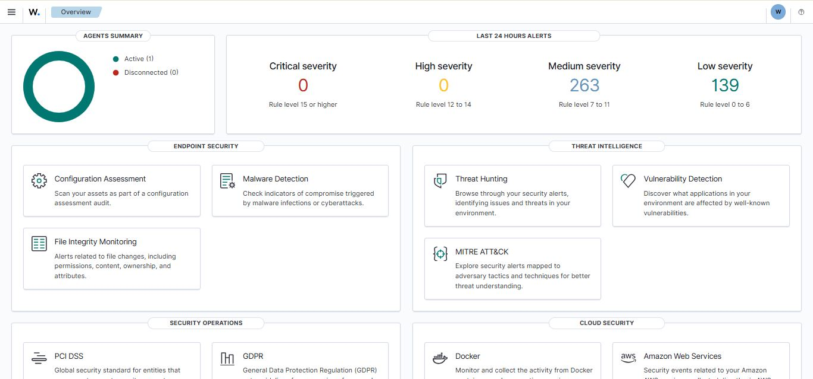

# Wazuh Cloud SIEM Lab Project

This project documents my hands-on experience with deploying a cloud-based SIEM using [Wazuh Cloud](https://wazuh.com/cloud/). I connected a Windows machine as an agent and monitored security events via the Wazuh dashboards.

## 🌐 Overview

- ✅ Wazuh Cloud instance provisioned
- ✅ Windows agent installed and connected
- ✅ Real-time log monitoring configured
- ✅ Dashboards explored for:
  - Security events
  - File integrity monitoring
  - Agent health
  - MITRE ATT&CK mapping

## 🧰 Tools Used

- **Wazuh Cloud**
- **Wazuh Windows Agent**
- **Windows 10/11**

## 📸 Screenshots

## 📖 What I Learned

- Basics of SIEM architecture
- How endpoint agents communicate with Wazuh
- Alert categories and MITRE mapping
- Importance of log normalization

## 🚀 Next Steps

- Add Linux and web server agents
- Configure email or Slack alerts
- Test rule tuning and custom alerting

---

